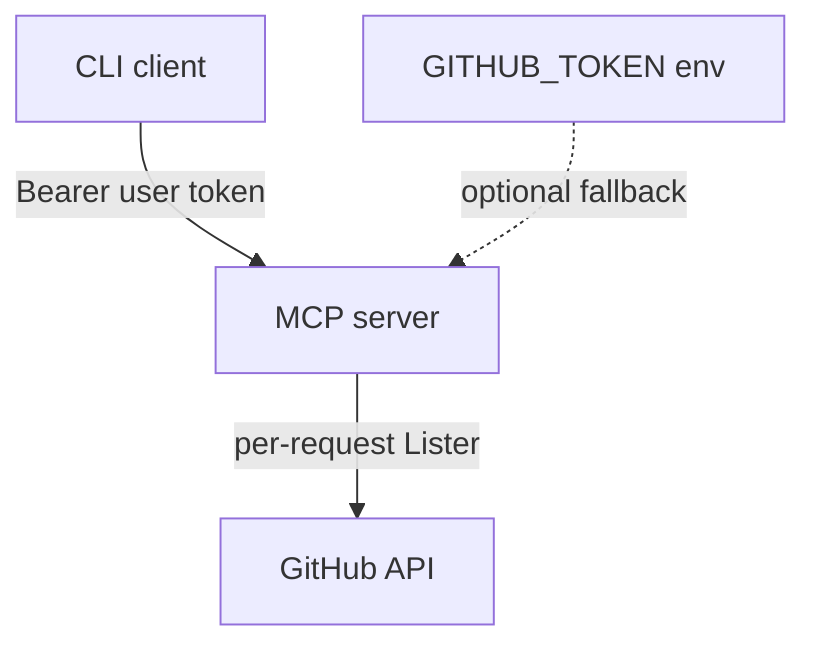

# gh-int-demo


## What this is

An MCP server in Go that exposes the GitHub API as agent tools, with a CLI client that authenticates via OAuth device flow and lists your repositories. Built as a demonstration of Go + third-party API integration + MCP/agentic tooling for a Tailscale code sample.

> MCP server built against [modelcontextprotocol/go-sdk](https://github.com/modelcontextprotocol/go-sdk) `@v1.6.1`.

## Architecture

```
CLI client (cmd/client)
  └─ OAuth device flow (internal/oauth) → GitHub access token
  └─ MCP client (streamable HTTP) → MCP server (cmd/server)
        └─ list_repositories tool (internal/mcptools)
              └─ GitHub REST API (internal/github)
```

**Local interactive demo:** the client obtains *your* token via device flow and sends it to the server as `Authorization: Bearer`. The server uses that token to call GitHub on your behalf.

**Server-only fallback:** optionally set `GITHUB_TOKEN` on the server so MCP tools can call GitHub without a client Bearer token (useful for quick demos and integration tests).

### Identity model



- **`AUTH_MODE=permissive`** (default): MCP accepts Bearer tokens or falls back to `GITHUB_TOKEN`.
- **`AUTH_MODE=require_bearer`**: MCP returns 401 without `Authorization: Bearer`.
- MCP tools resolve identity via `auth.Session` (`bearer` vs `server_default`); see `internal/auth`.
- Production path: OAuth 2.1 resource server + per-session token binding.

## Run it locally

### 1. Register a GitHub OAuth App

1. GitHub → **Settings** → **Developer settings** → **OAuth Apps** → **New OAuth App**
2. Enable **Device Flow** in the app settings
3. Note the **Client ID** (no client secret needed for public device-flow clients)
4. Export it: `export GITHUB_CLIENT_ID=your_client_id`

**Scope:** defaults to `public_repo` (least privilege). Pass `--scope repo` when private repos are needed.

### 2. Start the MCP server

```bash
go run ./cmd/server --transport http --addr :8080
```

Optionally set `GITHUB_TOKEN` if you want the server to use a token without the client sending Bearer auth.

Enable metrics: `ENABLE_DEBUG_VARS=1` then `GET /debug/vars`.

### 3. Run the CLI client

```bash
export GITHUB_CLIENT_ID=your_client_id
go run ./cmd/client --server http://localhost:8080/mcp
```

Follow the printed URL and code to authorize. The client invokes `list_repositories` and prints a table of your repos.

Flags: `--no-cache` skips writing `~/.gh-int-demo-token` (write-only demo cache; production would use OS keychain); `--scope repo` for private repos.

## Live deployment

Deployment is **manual** — CI does not publish the app. The repo includes `fly.toml` and a `Dockerfile` for [Fly.io](https://fly.io); deploy when you are ready.

- **Health check:** `GET /healthz` → `{"status":"ok","version":"...","commit":"<git-sha>"}`
- **MCP endpoint:** `POST /mcp` (streamable HTTP transport)

### First-time Fly setup

```bash
fly auth login
fly launch --no-deploy --name gh-int-demo --copy-config
fly secrets set GITHUB_TOKEN=ghp_your_demo_token   # optional fallback for MCP without Bearer
fly deploy
```

To **automate** deploys on push to `main`, add [`.github/workflows/deploy.yml`](.github/workflows/deploy.yml) (see [`.github/workflows/deploy.yml.backup`](.github/workflows/deploy.yml.backup) for a starting point) and set the `FLY_API_TOKEN` repository secret.

## Hardening choices

| Area | Implementation |
|------|----------------|
| Pagination | Follows GitHub `Link: rel="next"` until exhausted |
| HTTP timeouts | Shared `internal/httpx` client (30s overall, tuned transport) |
| Retries | 3× exponential backoff on 5xx; rate-limit wait capped at 60s |
| MCP errors | Structured `ToolError` JSON (`UNAUTHORIZED`, `RATE_LIMITED`, `UPSTREAM`, `INTERNAL`) |
| Correlation | `X-Request-ID` on MCP and outbound GitHub requests |
| Metrics | `expvar` at `/debug/vars`: GitHub latency count/sum/max/last (p99 → Prometheus in prod) |
| Auth | `internal/auth` session binding + `AUTH_MODE`; tools log `auth_source`; CallTool auth e2e in server tests |
| MCP tools | `list_repositories`, `get_repository` |
| Token cache | File mode `0600`, `--no-cache`; production would use OS keychain |

## Design notes

- **Device flow:** no redirect server or local callback port — ideal for CLI tools and demonstrates real OAuth2.
- **Retry/backoff:** GitHub client retries 5xx and transient network errors with exponential backoff.
- **Rate limits:** reads `X-RateLimit-*` headers on 403/429 and backs off until reset (capped at 60s).
- **Observability:** structured JSON logging via `log/slog` with per-request correlation IDs (`X-Request-ID`).

## What must NOT be used for production

- **Token lifecycle:** refresh/rotation instead of long-lived PATs on the server
- **Multi-user auth:** full OAuth 2.1 resource server instead of shared secrets
- **Observability:** Prometheus/Grafana and distributed tracing beyond expvar + structured logs
- **Secret management:** vault/KMS-backed secrets with rotation, not env-only config
- **Rate-limit budgets:** per-caller quotas and circuit breaking upstream of GitHub

## Development

Pushes to `main` run [CI](.github/workflows/ci.yml) (build, vet, tests, lint).

```bash
go build ./...
go vet ./...
go test ./... -short -count=1 -timeout 120s    # fast; skips OAuth slow_down test
go test ./... -race -count=1 -timeout 300s     # full suite with race detector
go test -tags=integration ./cmd/client/...     # live GitHub smoke (needs GITHUB_TOKEN)
golangci-lint run
```

## License

MIT
